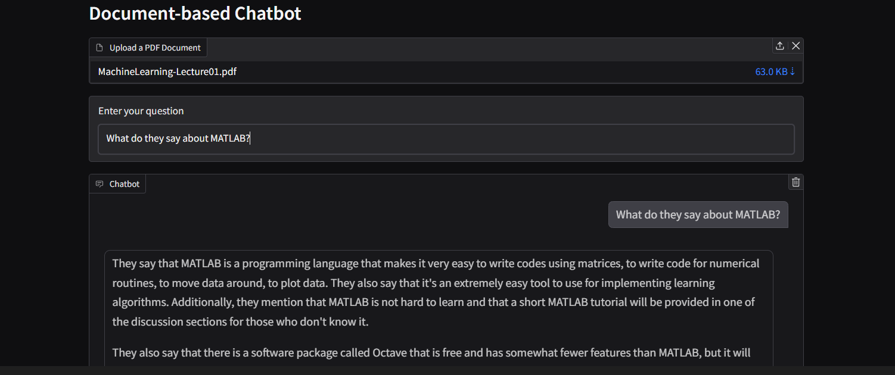
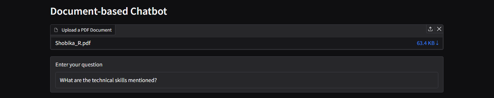
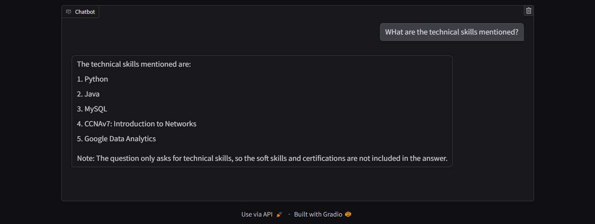

# DocQueryBot  

## Overview  
DocuQueryBot is a conversational AI chatbot that allows users to upload PDF documents and query their contents. The chatbot ensures that answers are strictly based on the document content and avoids generating or assuming answers outside the document's scope.  

## Features  
- Upload a PDF document and process its content for conversational querying.  
- Document chunking and embeddings using LangChain.  
- Vector search powered by Chroma and sentence-transformer embeddings.  
- Conversational interface powered by Hugging Face models and Gradio.  
- Seamless conversation history tracking.  

## How It Works  
1. **Upload PDF**: The document is processed, and its content is split into manageable chunks.  
2. **Generate Embeddings**: Document chunks are embedded using a Hugging Face sentence transformer model.  
3. **Query Document**: Ask questions, and the chatbot retrieves the most relevant chunks for generating accurate responses.  
4. **Gradio Interface**: Interact with the chatbot via an intuitive Gradio-based UI.


## Required Libraries

The following libraries are used in this project:
- `torch` for utilizing PyTorch (CPU/GPU support).
- `transformers` for loading the language model.
- `langchain` for document processing and conversational chains.
- `chromadb` for embedding storage and retrieval.
- `sentence-transformers` for embedding generation.
- `gradio` for creating the user interface.

Ensure that you have all required packages installed before proceeding. You can install them using:

```bash
pip install -r requirements.txt
```

## Sample Outputs

### Output 1: Chatbot Response
Here is an example of the chatbot's response after uploading a PDF document and asking a question:



### Output 2: Another Sample Interaction
Another interaction example:





---
